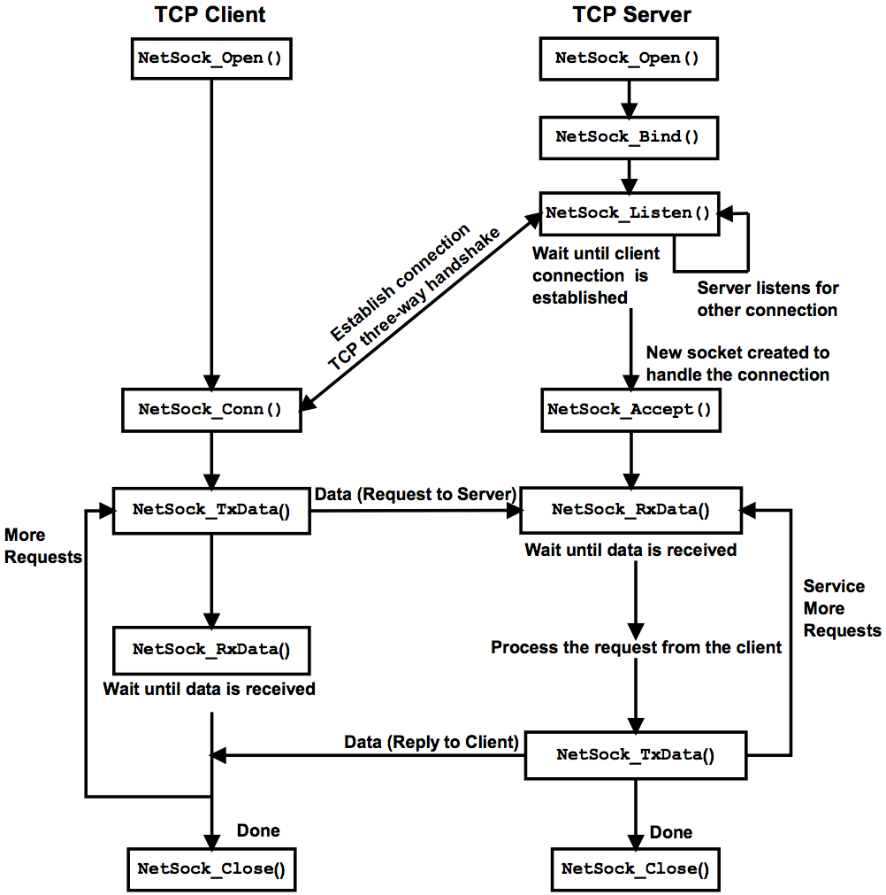

# cryptochat-server

**Description** : TCP Socket Server-Client Chat Application

**Requisite** : Make sure you have Python3 and Pip installed in your System

**How to Run (Linux)** :

1. Install requirements.txt to install necessary packages [**$ python3 -m pip install -r requirements.txt**]

2. Install colored library [**$ pip3 install colored**]

3. Run server.py to run server side and start the server [**$ python3 server.py**]

4. Run client.py to run client side and join the server [**$ python3 client.py**]

5. Group chat (text-only) with clients active in the server

6. Type [**Exit**] or [**exit**] or [**EXIT**] to leave chat and quit the server

**TCP Architecture** :

 
